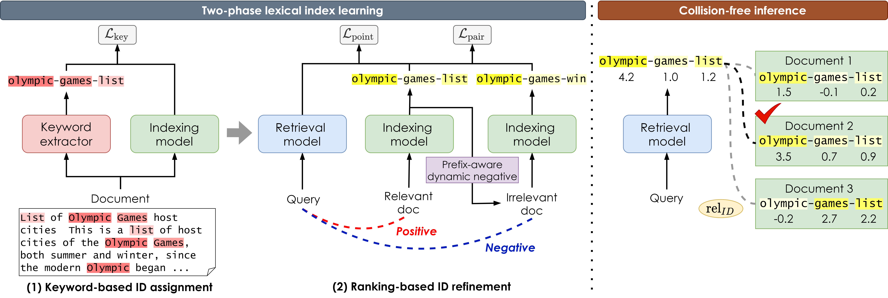
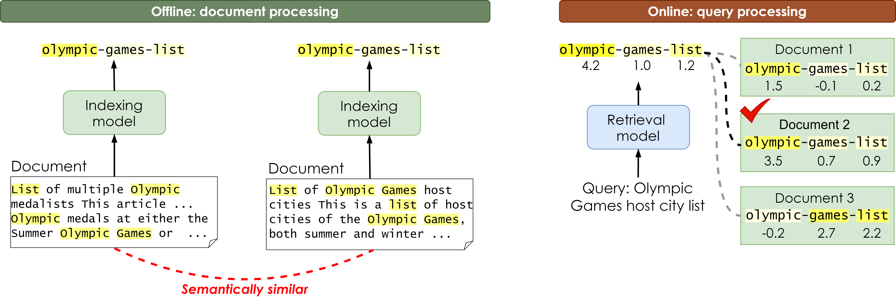

# GLEN: Generative Retrieval via Lexical Index Learning (EMNLP 2023)
This is the official code for the EMNLP 2023 paper "[GLEN: Generative Retrieval via Lexical Index Learning](https://arxiv.org/abs/2311.03057)".  


## Overview

GLEN (***G**enerative retrieval via **LE**xical ***N***dex learning*) is a generative retrieval model that learns to dynamically assign lexical identifiers using a two-phase index learning strategy.




The poster and the slide files are available at each link: [poster](assets/glen_poster.pdf) and [slide](assets/glen_slide.pdf). We also provide blog posts (Korean) at [here](https://dial.skku.edu/blog/2023_glen). Please refer to the paper for more details.


## Environment
We have confirmed that the results are reproduced successfully in `python==3.8.12`, `transformers==4.15.0`, `pytorch==1.10.0` with `cuda 12.0`. Please create a conda environment and install the required packages with the following scripts:
```
sh set_environment.sh
conda activate glen
```

Optionally, you can also install [GradCache](https://github.com/luyug/GradCache) to gradient cache feature during training **ranking-based ID refinement** by:
```
git clone https://github.com/luyug/GradCache
cd GradCache
pip install .
```

## Dataset
Datasets can be downloaded from: [NQ320k](https://o365skku-my.sharepoint.com/:f:/g/personal/sk1027_o365_skku_edu/Et5O6pBBRFhDszKxUd0S3wMB05986kg_bYi_uT8SRh80QQ?e=jAEowr), [MS MARCO Passage Ranking set](https://o365skku-my.sharepoint.com/:f:/g/personal/sk1027_o365_skku_edu/Evg4kq5x2OhOtxu4IMs_39sBcxYjY6EQLoqyKh5toM9bRg?e=jZW04M), [BEIR](https://o365skku-my.sharepoint.com/:f:/g/personal/sk1027_o365_skku_edu/EuSgMCJynLdCuKFG_UldBKMB953_RsbzA1jliw2ashEEGw?e=y57m5Y).  
After downloading each folder, unzip it into the `data` folder. The structure of each folder is as follows.

```
data
├── beir
│   ├── arguana
│   └── nfcorpus
├── nq320k
└── msmarco
```

- For NQ320k, we follow the same data preprocessing as [NCI](https://github.com/solidsea98/Neural-Corpus-Indexer-NCI) and the setup in [GENRET](https://github.com/sunnweiwei/GenRet), splitting the test set into two subsets; *seen test* and *unseen test*. 
- For MS MARCO passage ranking set, we use the official development set consisting of 6,980 queries with a **full corpus**, i.e., 8.8M passages. 
- For BEIR, we assess the model on Arguana and NFCorpus and the code is based on [BEIR](https://github.com/beir-cellar/beir).
- Further details are described in the paper.


## Training
The training process consists of two phases: **(1) Keyword-based ID assignment** and **(2) Ranking-based ID refinement**. In the `/examples` folder, we provide GLEN code for each phase: `glen_phase1`, `glen_phase2`.  Please refer to `src/tevatron` for the trainer.
Run the scripts to train GLEN from the scratch for NQ320k or MS MARCO.<br>

### NQ320k
```
# (1) Keyword-based ID assignment
sh scripts/train_glen_p1_nq.sh
```

```
# (2) Ranking-based ID refinement
sh scripts/train_glen_p2_nq.sh
```

### MS MARCO
```
# (1) Keyword-based ID assignment
sh scripts/train_glen_p1_marco.sh
```

```
# (2) Ranking-based ID refinement
sh scripts/train_glen_p2_marco.sh
```

You can directly download our trained checkpoints for each stage from the following link: [NQ320k](https://o365skku-my.sharepoint.com/:f:/g/personal/sk1027_o365_skku_edu/Eld_v5cO-s1ArCz-gkmjLbYBCD2f2xhgbALd6M4hoQnq5A?e=VC82mB), [MS MARCO](https://o365skku-my.sharepoint.com/:f:/g/personal/sk1027_o365_skku_edu/EnC1iEC3rApIjDcnVdVPN7ABTq2J8qYxEdw1ITfaDzR8uQ?e=vNhfoc)


## Evaluation
The evaluation process consists of two stages: **(1) Document processing via making document identifiers** and **(2) Query processing via inference**.  


Run the scripts to evalute GLEN for each dataset.<br>

### NQ320k
```
sh scripts/eval_make_docid_glen_nq.sh
sh scripts/eval_inference_query_glen_nq.sh
```

### MS MARCO
```
sh scripts/eval_make_docid_glen_marco.sh
sh scripts/eval_inference_query_glen_marco.sh
```

### BEIR
```
# Arguana
sh scripts/eval_make_docid_glen_arguana.sh
sh scripts/eval_inference_query_glen_arguana.sh
```

```
# NFCorpus
sh scripts/eval_make_docid_glen_nfcorpus.sh
sh scripts/eval_inference_query_glen_nfcorpus.sh 
```

## Acknowledgement
Our code is mainly based on [Tevatron](https://github.com/texttron/tevatron). Also, we learned a lot from [NCI](https://github.com/solidsea98/Neural-Corpus-Indexer-NCI), [Transformers](https://github.com/huggingface/transformers), and [BEIR](https://github.com/beir-cellar/beir). We appreciate all the authors for sharing their codes.


## Citation
If you find this work useful for your research, please cite our paper:
```
@inproceedings{lee-etal-2023-glen,
    title = "{GLEN}: Generative Retrieval via Lexical Index Learning",
    author = "Lee, Sunkyung  and
      Choi, Minjin  and
      Lee, Jongwuk",
    editor = "Bouamor, Houda  and
      Pino, Juan  and
      Bali, Kalika",
    booktitle = "Proceedings of the 2023 Conference on Empirical Methods in Natural Language Processing",
    month = dec,
    year = "2023",
    address = "Singapore",
    publisher = "Association for Computational Linguistics",
    url = "https://aclanthology.org/2023.emnlp-main.477",
    doi = "10.18653/v1/2023.emnlp-main.477",
    pages = "7693--7704",
}
```

## Contacts
For any questions, please contact the following authors via email or feel free to open an issue 😊
- Sunkyung Lee sk1027@skku.edu
- Minjin Choi zxcvxd@skku.edu